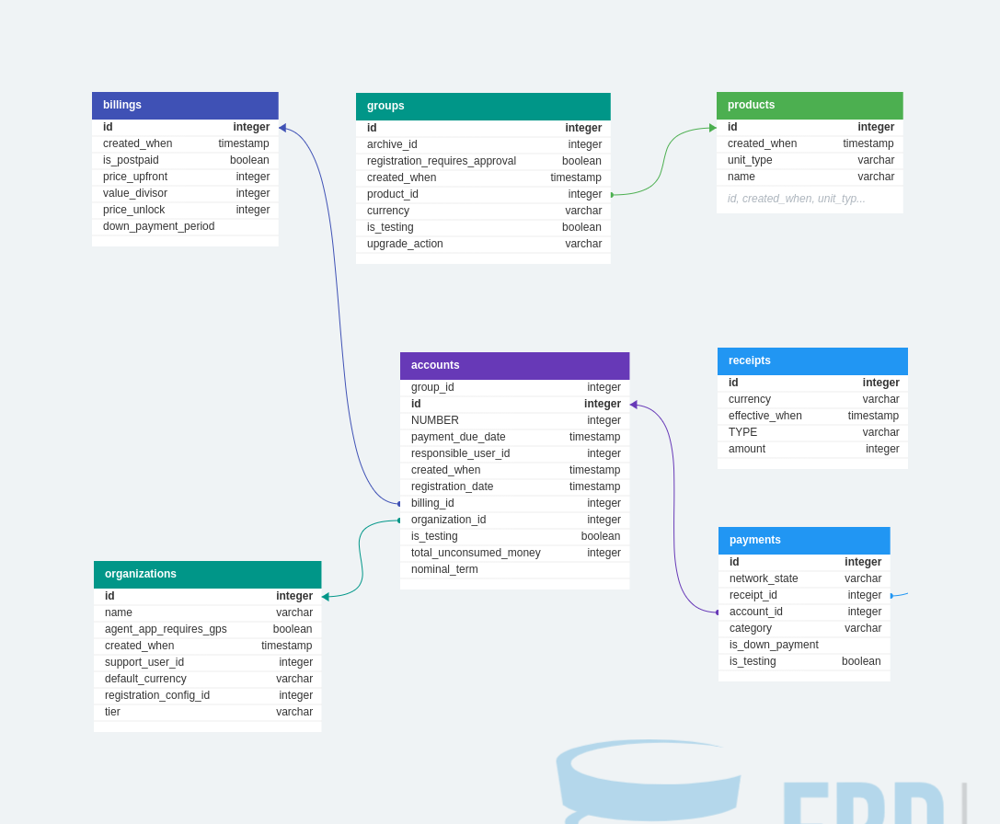

# Take Home Assignement

## Data Analytics Engineer

### Problem Statement
With datasets provided, I am required to answer atleast the following business problems.
1. Prepare a `sales dashboard` (aggregated on a monthly basis) to show loan portfolio
performance. Include at least the following key metrics: `Overall Collection Rate` (OCR)
and `First Payment on Time` (FPOT). Definitions for these metrics can be found in the
Data Dictionary below.
2. Share your `insights` based on the previous step's dashboard.
3. We are interested in forming new or improved partnerships with Merchants that sell
products that positively impact portfolio health performance. Identify the `products` and
`merchants` that have the `best portfolio health performance`.
4. What `other data `would you like to have to provide more detailed insights? What
`questions arose` during the analysis?

### Introduction
In this interview, I have been tasked with analyzing Angaza's dataset about customer loaning transaction details. The dataset comprise of seven csv files that represent tables in a relational database. The problem statement is centered around understanding customer behaviour and product portfolio, a mandatory focus for business if they are to remain afloat and thrive in the market. With good understanding of product performance and their consumption trends, businesses are able to create robust marketing campaigns that deliver personalized experienced to each indicidual customer.

It is therefore of essence that a thorough analysis is conducted in to identify key metrics and powerful insights for data driven decision making.

### Dataset Assessment
Before deep dive into analysis, I took time to assess the dataset's viability to delivering desired insights. Apart from issues with  attribute naming conventions and some missing data entries, the dataset had minimal details about products' transaction details. .To ensure data integrity, I maintained the naming convention while designing its data model.

Since each dataset has a unique ID, I utilized conditional formatting to identify and highlight any duplicate ID numbers that may have occurred as a result of data collection or entry errors. Fortunately,there were no duplicate IDs.I used DBeaver to perform data validations such as ensuring data accuracy and consistency.

### Data Analysis
* Designing and implementation of data model

After designing the model below with `ERD Lab` for the relational database;


I implemented the model on postgresql database using [this](data_model/angaza.sql) sql script. With tables created, I populated the database with the dataset to begin my exploratory analysis.

* Are there receipt entries with negative amounts? How many are they?

```
select
	id,
	amount
from receipts r
where amount < 0;
```
The above query returns enreies of receipt IDs registering distinct negative values of `-99999999`:

|id|amount|
|---|---|
|451105420|	-99999999|
|482758043|	-99999999|
|425184207|	-99999999|

There are _43_ entries of negative amounts. When aggregating payment collctions, knowledge about these negative amounts would prevent the mistake of manifesting false collections portfolio.

***

* What fiscal year does the data cover?
```
select
    distinct DATE_PART('year', r.effective_when::date) as year
from receipts r;
```
|year|
|---|
|2023.0|
|1900.0|
|2022.0|

The dataset captures transaction details from  the year `1900` which does not make sense for accounting purposes. There is need to consult reconciliation team for correction inorder to adjust overall callection rate.
```
select 
    count(r.id)
from receipts r 
where DATE_PART('year', r.effective_when::date) = 1900;
```
There are `30` counts of these entries amounting to `KES 13806`.

***

* What currencies are payments made on?
```
select 
	distinct currency 
from receipts r;
```
There are two distinct currencies captured.

|currency|
|---|
|KES|
|USD|

This should be taken into account when performing any aggregations involving payments.

***

* How much loan was disbursed to each merchant's account?
```
select 
	o.id as merchant_id,
	a.id as account_id,
	b.price_unlock as account_loan  
from organizations o 
inner join accounts a on o.id = a.organization_id
inner join billings b on a.billing_id = b.id
order by o.id; ```

|merchant_id|account_id|account_loan
|---|---|---|
|1049|	5952204|	28050|
|1049|	5806425|	28005|
|1049|	5832935|	33189|
|1049|	5816465|	21550|
|1049|	5823812|	28005|

There are `1961` entries returned in the above format. It is evident from this output that a merchant can have multiple acoounts. This prompted me to check  each merchant's account_id count.

```
select 
	count(id) as count,
	organization_id as merchant_id 
from accounts a
group by organization_id
order by count(id) desc
limit 5;
```
|count|merchant_id|
|---|---|
|409|	1062|
|379|	1092|
|203|	1064|
|184|	1063|
|134|	1086|
The top five merchants with maximum count of loan accounts.

***

* What is the cumulative loan amount received received by each merchant?
```
with disbursed_loan as(select 
	o.id as merchant_id,
	a.id as account_id,
	b.price_unlock as total_loan  
from organizations o 
inner join accounts a on o.id = a.organization_id
inner join billings b on a.billing_id = b.id
)
select 
	db.merchant_id as merchant_id,
	sum(db.total_loan) as merchant_loan 
from disbursed_loan db
group by merchant_id
order by sum(db.total_loan) desc
limit 5;
```
|merchant_id|merchant_loan|
|---|---|
|1062|	8886443|
|1092|	7988025|
|1063|	3819500|
|1086|	2785050|

Overally, there are `22` merchants who have received loan products from Angaza. The query above returns the first five customers with max cumulated loan disbursement.

***

* What is the total amount of payments received from each account?
```
select
	account_id,
	sum(payment) as collected_payment
from
	(select
	a.id as account_id,
	p.id as payment_id,
	r.id as receipt_id,
	case
        when r.currency = 'USD' and DATE_PART('year', r.effective_when::date) = 2022 then r.amount * 100
        when r.currency = 'USD' and DATE_PART('year', r.effective_when::date) = 2023 then r.amount * 110
        else r.amount
    end as  payment
from payments p
inner join accounts a on p.account_id = a.id
inner join receipts r on p.receipt_id = r.id
where r.amount >= 0) as payment_details
group by account_id
order by sum(payment) desc;
```
The first five max account payments are:
|account_id|collected_payment|
|---|---|
|5905337	|119338|
|6040852	|115240|
|5969680	|104650|
|5929037	|90425|
|5796858	|85442|

***

* How do loan disbursement and collections compare overally?
```
with pms as(
	select
		a.id as account_id,
		o.id as merchant_id,
		p.id as payment_id,
		r.id as receipt_id,
		case
	        when r.currency = 'USD' and DATE_PART('year', r.effective_when::date) = 2022 then r.amount * 100
	        when r.currency = 'USD' and DATE_PART('year', r.effective_when::date) = 2023 then r.amount * 110
	        else r.amount
	    end as  payment
	from payments p
	inner join accounts a on p.account_id = a.id
	inner join organizations o on a.organization_id = o.id 
	inner join receipts r on p.receipt_id = r.id
	where r.amount >= 0
),
lns as(
	select 
		o.id as merchant_id,
		a.id as account_id,
		b.price_unlock as total_loan  
	from organizations o 
	inner join accounts a on o.id = a.organization_id
	inner join billings b on a.billing_id = b.id
)
select 
	(select SUM(payment) from pms) as collected_payments,
 	(select SUM(total_loan) from lns) as disbursed_loan;
```
|collected_payments|disbursed_loans|
|---|---|
|35163303|	42127670|

Overally, the amount of loaned products is higher than collected payments. This is fairly a normal scenario in institutions offering financial services.

***

* What is the overall collection per month?

```
select  	
  	collection_year,
  	collection_month,
  	SUM(collected_payment) AS monthly_collection
from
  (
    select
      a.id as account_id,
      DATE_PART('month', r.effective_when::date) as month_num,
      to_char(r.effective_when::date, 'Month') as collection_month,
      DATE_PART('year', r.effective_when::date) AS collection_year,
      case
        when r.currency = 'USD' and DATE_PART('year', r.effective_when::date) = 2022 then r.amount * 100
        when r.currency = 'USD' and DATE_PART('year', r.effective_when::date) = 2023 then r.amount * 110
        else r.amount
      end as collected_payment
    from
      payments p
      inner join accounts a on p.account_id = a.id
      inner join receipts r on p.receipt_id = r.id
    where
      r.amount >= 0
      and DATE_PART('year', r.effective_when::date) in (2022, 2023)
  ) as coll
 group by
 collection_year,
 collection_month,
 month_num
order by
  collection_year,
  month_num;
  ```
The first month to register payment collection is August 2022 while the latest is April 2023.
|collection_year| collection_month| monthly_collection|
|---|---|---|
|2022.0|	August|   	3420711|
|2022.0|	September|	8101145|
|2022.0|	October|  	4796920|
|2022.0|	November| 	4136630|
|2022.0|	December| 	4639369|
|2023.0|	January|  	3941135|
|2023.0|	February| 	3236114|
|2023.0|	March|    	2278913|
|2023.0|	April|    	598560|

*** 

* Overall disbursment per month
```
select
	disbursed_month,
	disbursed_year,
	sum(price_unlock) as monthly_disbursement
from(
	select
		a.id as account_id,
		DATE_PART('month', b.created_when::date) as month_num,
		to_char(b.created_when ::date, 'Month') as disbursed_month,
		DATE_PART('year', b.created_when ::date) as disbursed_year,
		b.price_unlock as price_unlock,
		substring(a.nominal_term from '"days":[ ]*([0-9]+)[ ]*')::integer AS loan_duration_days,
		round(substring(a.nominal_term from '"days":[ ]*([0-9]+)[ ]*')::numeric / 
		DATE_PART('day', DATE_TRUNC('month', a.registration_date::date + interval '1 month') - DATE_TRUNC('month', a.registration_date::date))::numeric,1)  as loan_duration_month
	from billings b
	inner join accounts a on a.billing_id = b.id
	) as am_due
group by
 disbursed_year,
 disbursed_month,
 month_num
ORDER BY
  disbursed_year,
  month_num;
```
|disbursed_month|disbursed_year|monthly_disbursement|
|June     	|2022.0|	286605|
|July     	|2022.0|	10374843|
|August   	|2022.0|	18353139|
|September	|2022.0|	5180796|
|October  	|2022.0|	1325850|
|November 	|2022.0|	4156159|
|December 	|2022.0|	121125|
|January  	|2023.0|	285425|
|February 	|2023.0|	699725|
|March    	|2023.0|	1261003|
|April    	|2023.0|	83000|

Unlike collections which began on August, collections are registered as from June 2022.

***


